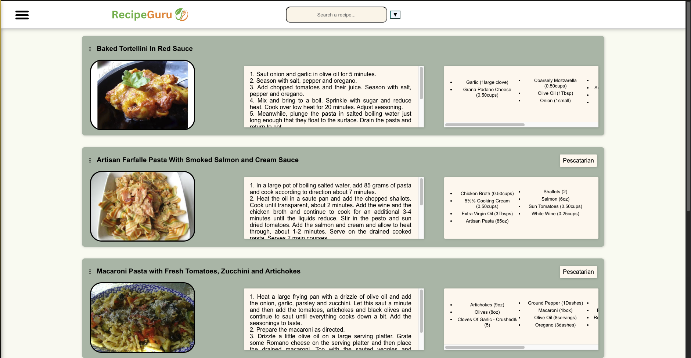

# Recipe Search and Meal Planner

A full-stack application for searching, planning, and managing recipes, built using React for the frontend, Java for the backend, and PostgreSQL as the database.

---

## Features

### Frontend:
- **Built with React**: A dynamic and responsive user interface.
- **Recipe Display**:
  - Displays five recipes on the front page with:
    - Brief image
    - Title
    - Ingredient list
    - Description
    - Intolerances/Diet/Type of food
  - Recipe data is fetched using the [Spoonacular API](https://spoonacular.com/food-api) with a free API key.
- **Search Bar with Dropdown Filters**:
  - Query recipes by name or ingredients.
  - Refine searches with filters for cuisine, diet, and intolerances.
- **Meal Planner Integration**:
  - Add recipes to specific days of the week.
  - Navigate to the Meal Planner page to view recipes for each day.
  - Expand recipes for detailed information or remove them with a click.
- **Shopping List**:
  - Organizes ingredients by recipe.
  - Provides a summarized ingredient list with cost predictions.
  - Remove individual recipes or expand them to view details.

### Backend:
- **Java**: Provides RESTful APIs to manage user interactions and handle database queries.
- **PostgreSQL**: Stores recipe metadata (e.g., IDs) for quick retrieval and to support dynamic recipe generation.
- **Dynamic Recipe Pages**:
  - Generated based on IDs fetched from the API.
  - Information is pulled dynamically without pre-built storage, supporting infinite recipe generation.

---

## Technology Stack

### Frontend:
- React
- Axios (for API calls)
- CSS for styling

### Backend:
- Java (Spring Boot)
- PostgreSQL
- RESTful APIs

### API:
- [Spoonacular API](https://spoonacular.com/food-api) (Free API Key)

---

## Screenshots and Demo

### Screenshots:
1. **Homepage**: Displays five recipes with key details.  
   

2. **Search Bar with Filters**: Allows users to query recipes and apply filters.  
   

3. **Addition Buttons**: Allows users to add recipe to planner or shopping list.  
   

4. **Meal Planner**: View and manage recipes for specific days of the week.  
   

5. **Shopping List**: Organize and summarize ingredients for recipes.  
   

6. **Recipe Page**: View all infor for a specific recipe.  
   

---

## Project Structure

```
recipe-service-app/
├── src/
│   ├── components/    # Reusable components and ther CSS styles
│   ├── pages/         # Pages (Homepage, Meal Planner, etc.)
│   └── images/        # Images
├── backend/               # Java backend code
│   ├── src/
│   │   ├── main/
│   │   └── test/        # Unit tests
└── README.md            # Project documentation
```

---

## Deployment

### Local Setup:
1. Clone the repository:
   ```bash
   git clone https://github.com/Mtkurilko/recipe-service-app.git
   ```

2. Navigate to the frontend and backend directories to install dependencies:
   - **Frontend**:
     ```bash
     cd frontend
     npm install
     npm start
     ```
   - **Backend**:
     ```bash
     cd backend
     mvn spring-boot:run
     ```

3. Set up the PostgreSQL database:


4. Add your Spoonacular API key to the environment variables in both frontend and backend configurations.

### Built Version:
[Live Demo](https://your-online-demo-link.com)

---

## Highlights
- **Frontend-First Approach**:
  - All dynamic interactions and rendering occur on the React frontend.
  - Backend services (in `backend/`) are limited to API calls and database management.
- **Scalability**:
  - Dynamic API fetching and database storage allow infinite recipe generation.
- **Database Integration**:
  - Stores and retrieves recipes efficiently to reduce API calls while maintaining dynamic content generation.

---

For further inquiries or technical details, refer to the source code.

